# 🏗️ Odoo Estate Modülü - Mimari Diyagram

Bu dokümanda Estate modülünün tüm bileşenleri ve aralarındaki bağlantılar görsel olarak açıklanmıştır.

---

## 📁 1. Dosya Yapısı ve Bağlantılar

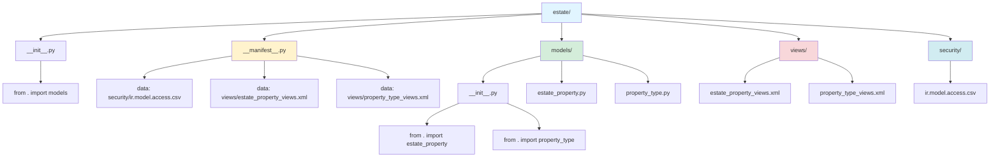

---

## 🎯 2. Python Class'lar ve İlişkileri

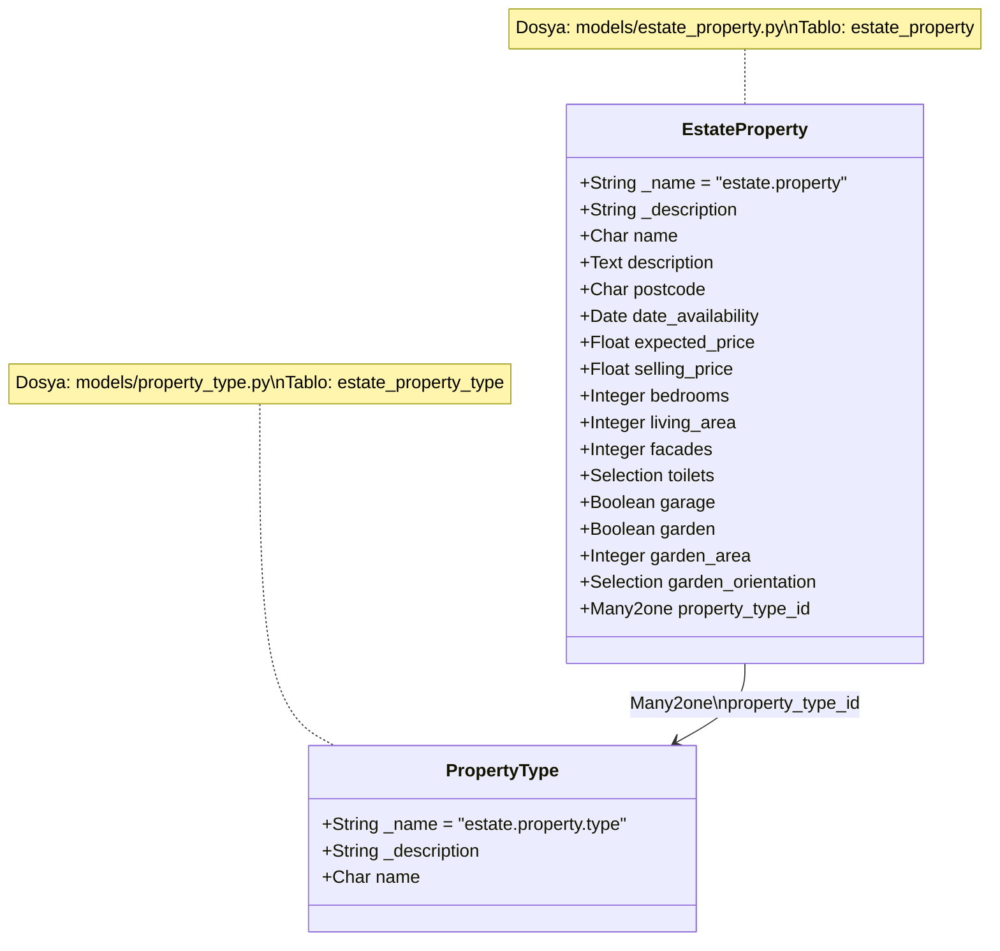

---

## 🗄️ 3. Veritabanı Tabloları ve İlişkiler

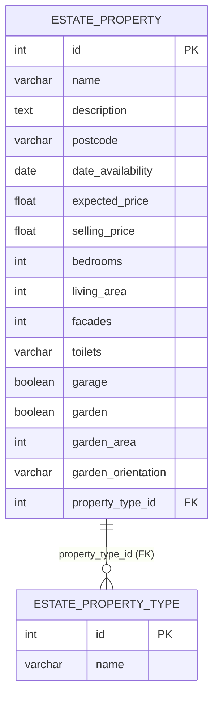

**Açıklama:**
- `ESTATE_PROPERTY.property_type_id` → `ESTATE_PROPERTY_TYPE.id` (Foreign Key)
- Bir Property Type'a birçok Property bağlı olabilir (One-to-Many)
- Her Property'nin bir Property Type'ı vardır (Many-to-One)

---

## 📋 4. XML View Records ve Bağlantıları

### estate_property_views.xml

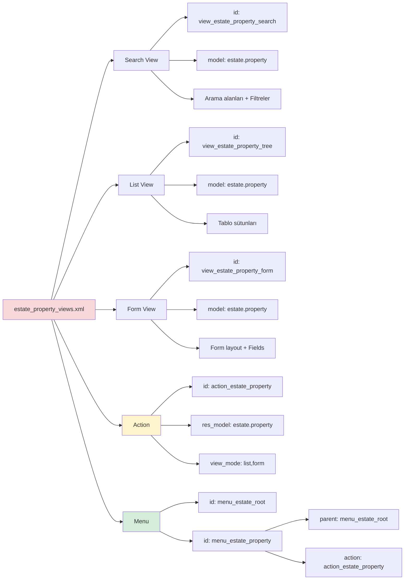

### property_type_views.xml

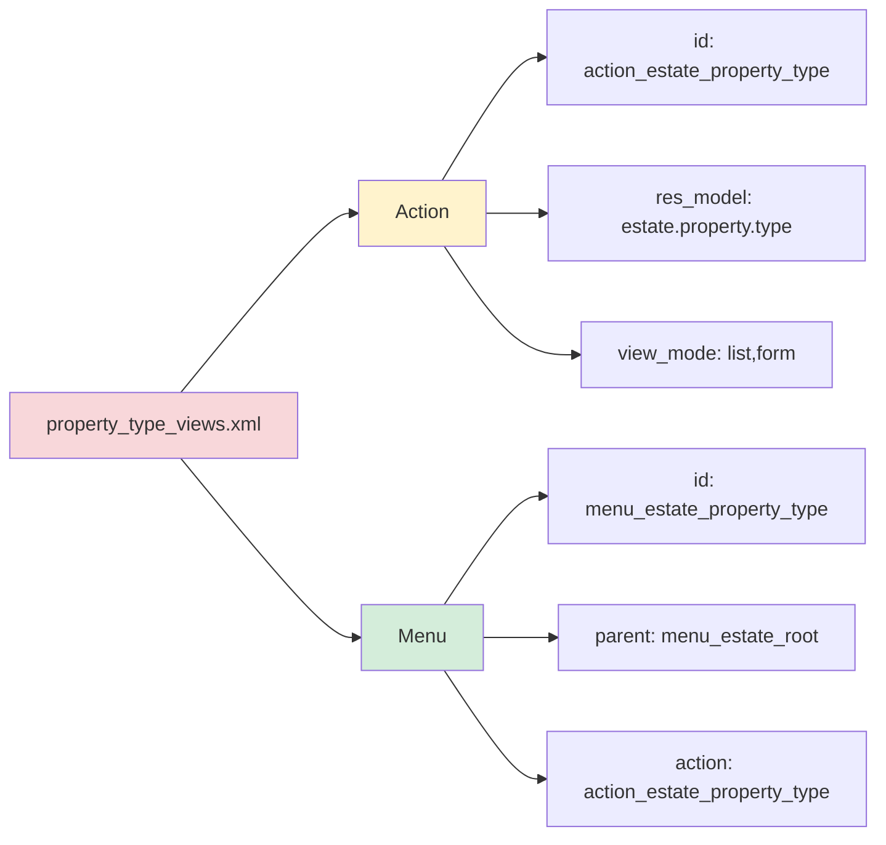

---

## 🎭 5. Model-View-Controller (MVC) Akışı

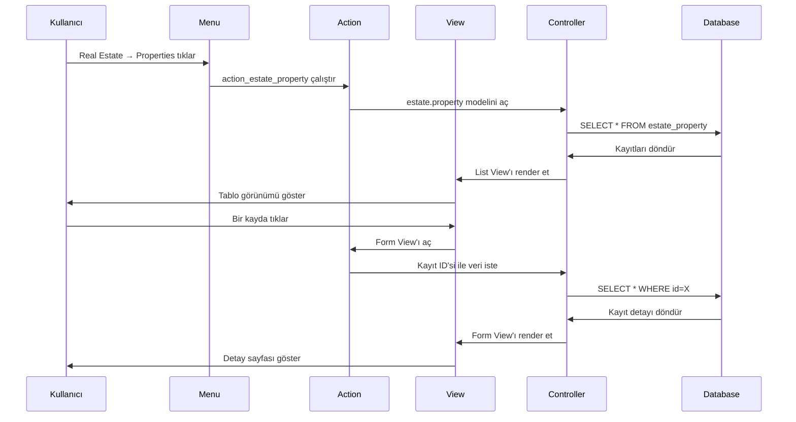

---

## 🔗 6. Many2one İlişkisi Detaylı

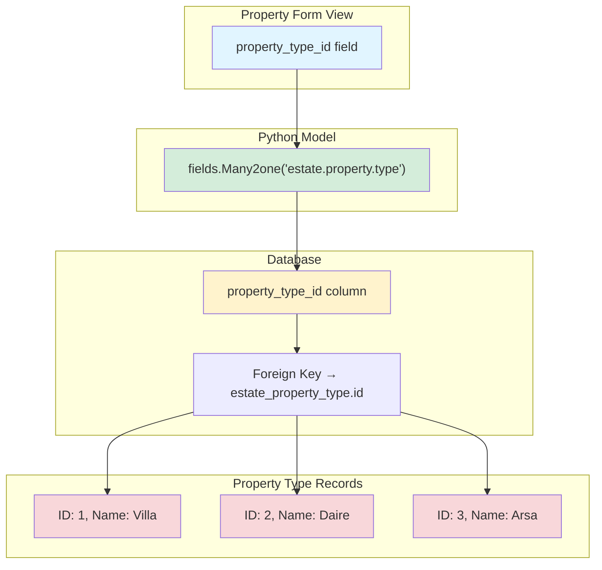

**Kullanıcı Perspektifi:**
```
Form'da görünen:
┌─────────────────┐
│ Mülk Tipi       │
│ [Villa ▼]       │ ← Dropdown
│   - Villa       │
│   - Daire       │
│   - Arsa        │
└─────────────────┘

Veritabanında saklanan:
property_type_id = 1 (Villa'nın ID'si)
```

---

## 🌳 7. Menu Hiyerarşisi

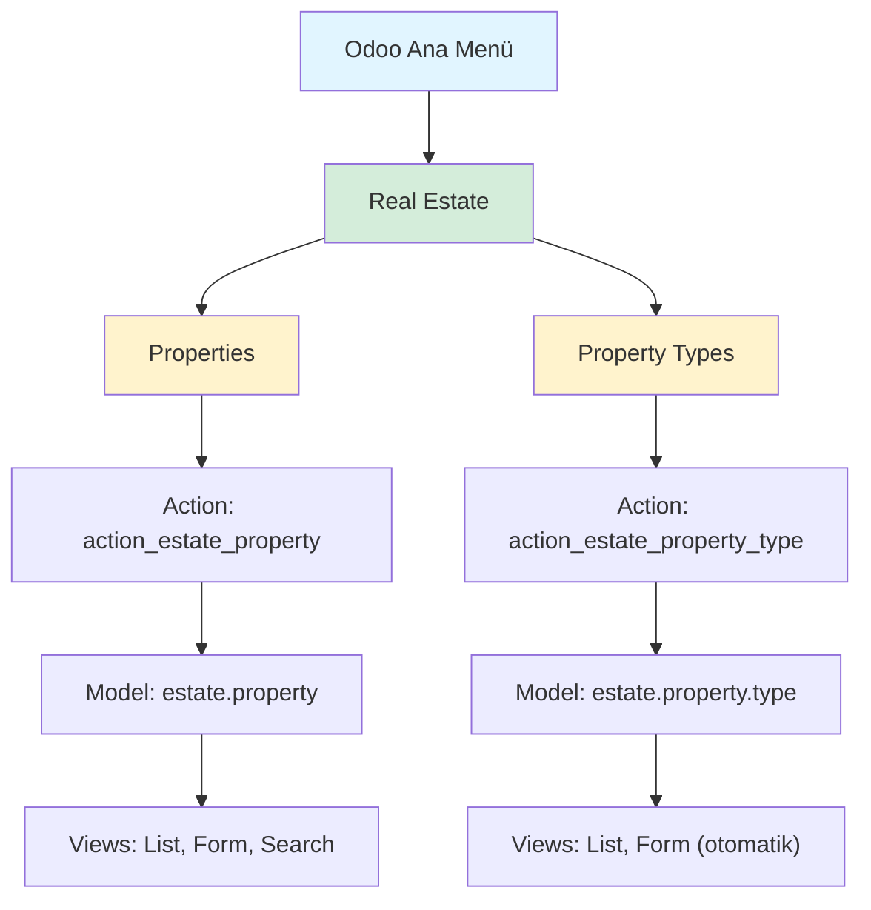

**Ekranda Görünüm:**
```
┌────────────────────────────────────┐
│ [Logo] Real Estate ▼  Discuss ...  │ ← Üst Navbar
├────────────────────────────────────┤
│        ↓ Dropdown                  │
│     ┌──────────────┐               │
│     │ Properties   │ ← Tıklayınca list view
│     │ Property Types│ ← Tıklayınca list view
│     └──────────────┘               │
└────────────────────────────────────┘
```

---

## 🔄 8. Veri Akışı: Kayıt Oluşturma

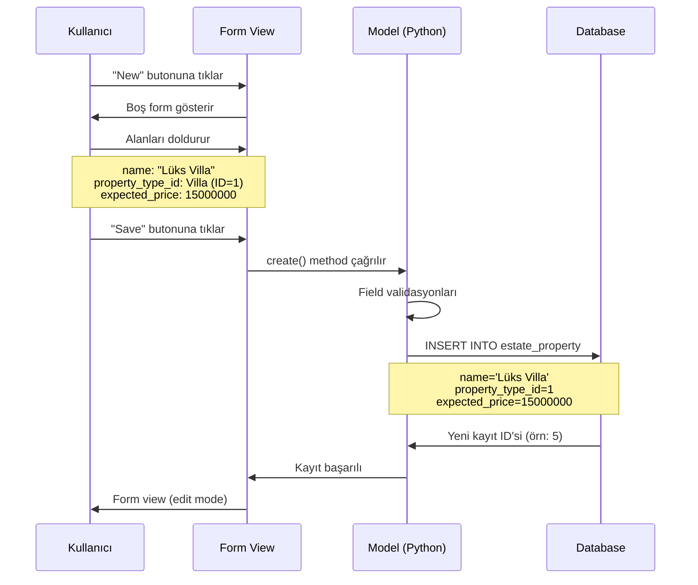

---

## 📊 9. Security (Erişim Hakları) Akışı

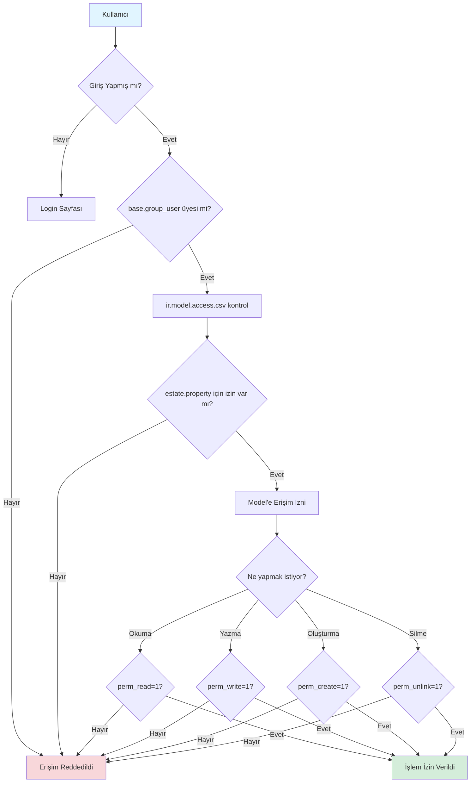

---

## 🎯 10. Tam Sistem Bağlantı Diyagramı

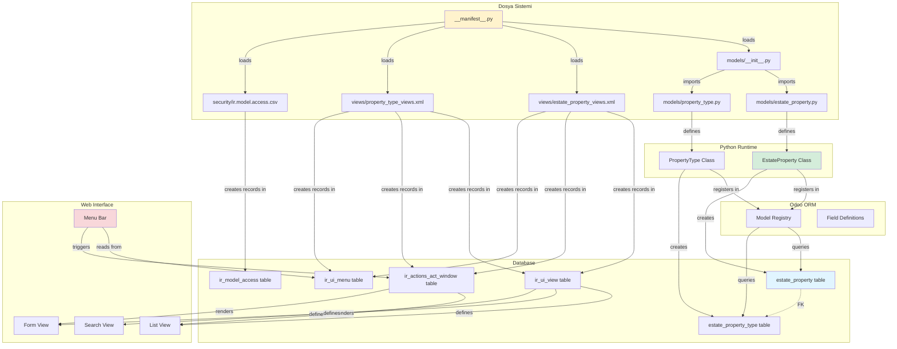

---

## 📝 11. Özet: Her Şey Nasıl Bağlı?

### Adım Adım Akış:

1. **Modül Yükleme:**
   - `__manifest__.py` → Odoo'ya modülü tanıtır
   - `data` listesi → Hangi dosyaların yükleneceğini belirtir

2. **Python Kodları:**
   - `models/__init__.py` → Python dosyalarını import eder
   - `estate_property.py` → `EstateProperty` class'ını tanımlar
   - `property_type.py` → `PropertyType` class'ını tanımlar

3. **ORM (Object-Relational Mapping):**
   - Class'lar → Veritabanı tablolarına dönüşür
   - Field'lar → Tablo sütunlarına dönüşür
   - Many2one → Foreign key ilişkisi oluşturur

4. **XML View'lar:**
   - View record'ları → `ir_ui_view` tablosuna kaydedilir
   - Action record'ları → `ir_actions_act_window` tablosuna kaydedilir
   - Menu record'ları → `ir_ui_menu` tablosuna kaydedilir

5. **Security:**
   - CSV dosyası → `ir_model_access` tablosuna kaydedilir
   - Kullanıcı erişimlerini kontrol eder

6. **Web Arayüzü:**
   - Kullanıcı menüye tıklar
   - Action çalışır
   - View render edilir
   - Database'den veri çekilir
   - Kullanıcıya gösterilir

---

## 🎓 Anahtar Kavramlar

| Kavram | Açıklama | Örnek |
|--------|----------|-------|
| **Model** | Python class, veritabanı tablosu | `EstateProperty` |
| **Field** | Model özelliği, tablo sütunu | `name`, `price` |
| **Many2one** | Çoktan bire ilişki, foreign key | `property_type_id` |
| **View** | Kullanıcı arayüzü tanımı | List, Form, Search |
| **Record** | XML'de tanımlanan kayıt | `<record id="...">` |
| **Action** | View'ları açan tetikleyici | `action_estate_property` |
| **Menu** | Navigasyon öğesi | Real Estate → Properties |

---

**Artık her şeyin nasıl bağlı olduğunu görüyorsunuz! 🎉**
